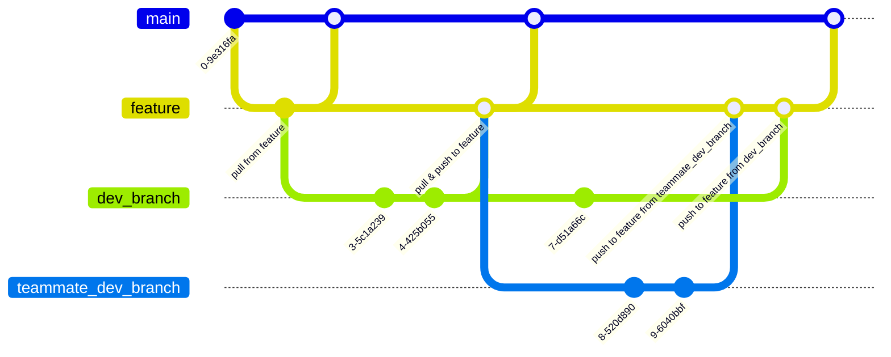

# Rotten Potatoes
## Final Submission Docs
- [Final Project Document](./docs/FinalProject_RottenPotatoes.pdf)
- [SQL Schema ER Diagram](/docs/img/er-dgrm-rotten-potatoes.png)
- [SQL Schema File](./docs/rotten_potatoes.sql)
## Table of Contents
- [Build Instructions](#build-instruction)
- [Git Instructions](#git-instructions)
- **Documents** 
  - [Documents](/docs/README.md)
  - [TODO List](/docs/plan/TODO.md)
  - [API Notes](/docs/plan/API%20Notes.md)
  - [SQL Notes](/docs/plan/SQL%20Notes.md)
- **Diagrams**
  - [ER Diagrams](/docs/plan/diagrams/er.md)
  - [View Diagrams](/docs/plan/diagrams/view.md)
  - [State Diagrams](/docs/plan/diagrams/state.md)
  - [UI Diagrams](/docs/plan/diagrams/ui.md)

---
## Build Instruction
1) in working project folder directory enter in terminal/bash: `npm install` to downloaded all necessary dependencies
```bash
$ npm install
```
2) in working project folder directory enter in terminal/bash:
```bash
$ touch .env
```
  - this will create a file where you can place your environment variables

3) open the `.env` file and enter in your environment variables as followed
```bash
# can be changed to a port you'll be using:
PORT=3000

# reference: https://www.omdbapi.com , *requires* api key
OMDB_API_KEY=your_api_key

# reference: https://developer.themoviedb.org, *requires* api key
TMDB_API_KEY=your_api_key
TMDB_READ_ACCESS_TOKEN=your_read_access_token_here

# DB Connection Info
DB_HOST=host_name_goes_here
DB_USER=db_username_goes_here
DB_PASSWORD=db_password_goes_here
DB_NAME=db_name_goes_here
```
4) if you look at the `package.json` file, you'll see that I've included some scripts to make some commands easier to remember, you can call them using `npm run script-name`
for example: the call for `nodemon index.js` to run the server is just:
```bash
$ npm run server
```

5) Bootstrap has also been installed if you wish to make changes, ie customize themes etc. run these two scripts in a seperate terminal to see build changes made, and for it to watch for any changes made.
```bash
npm run build-css
npm run watch-css
```

6) refer to [SQL Notes](/docs/plan/SQL%20Notes.md) in order to setup your own working database via https://cloud.fastcomet.com, ensure that your `.env` environment variables match according to the assigned values of your newly created db.
---
## Git Instructions
our `feature` branch will act as our ordered sandbox, where we push and pull from regularly. consider `dev_branch` the branch you intend to work in.
- when pushing to feature do a self check and ensure all components are working as intended, upon successful push to `feature` let team know via discord
- pull from feature regularly to get the most up to date code
- we'll reserve pushes to `main`, after full team review.
