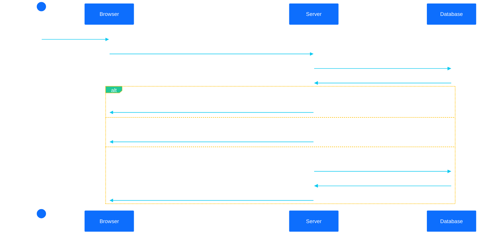
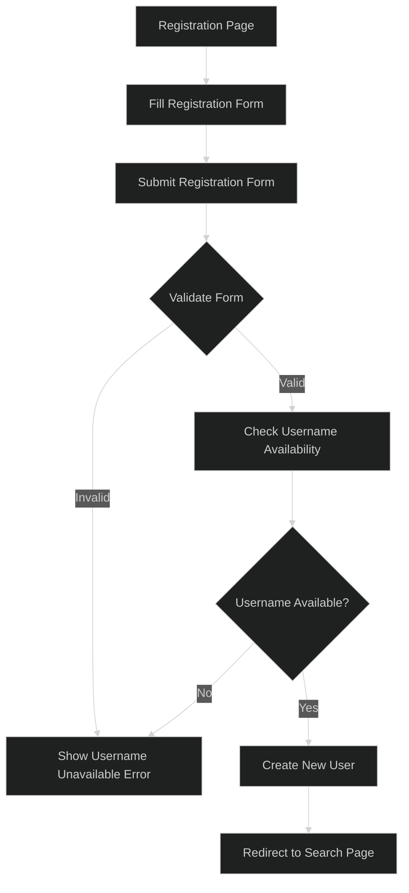
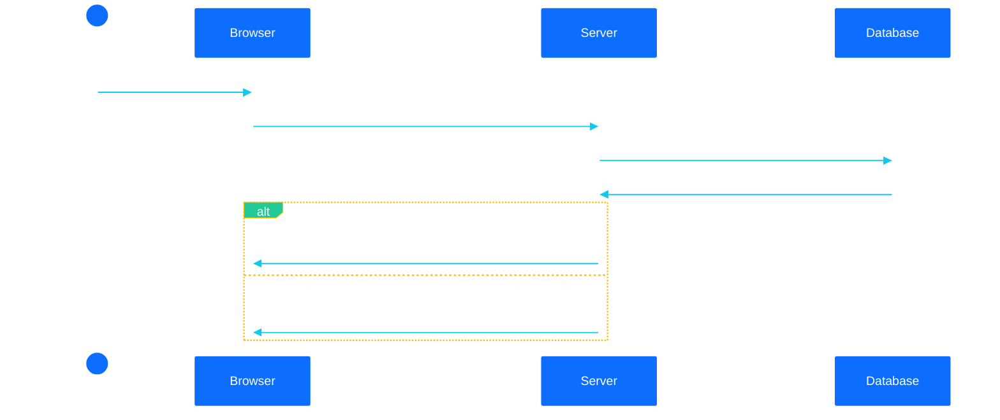
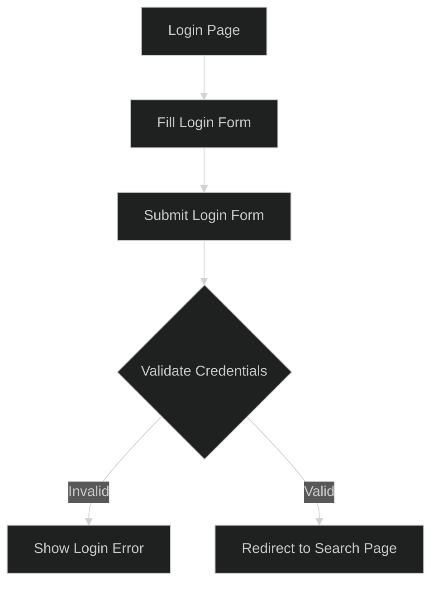
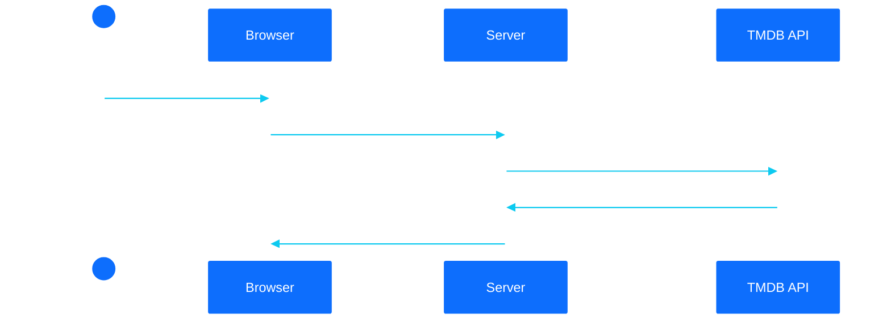
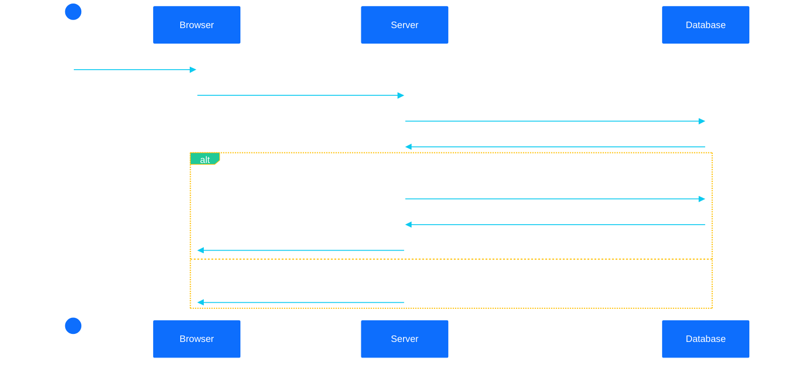
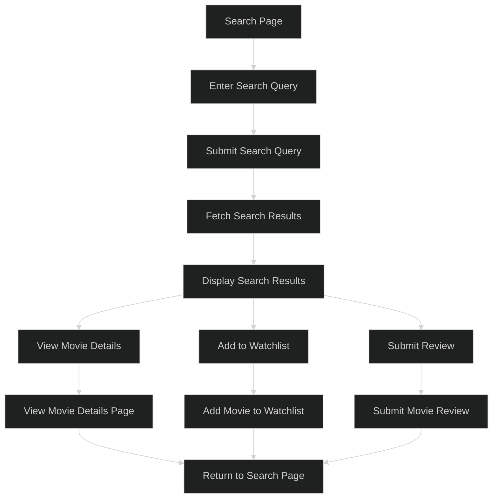
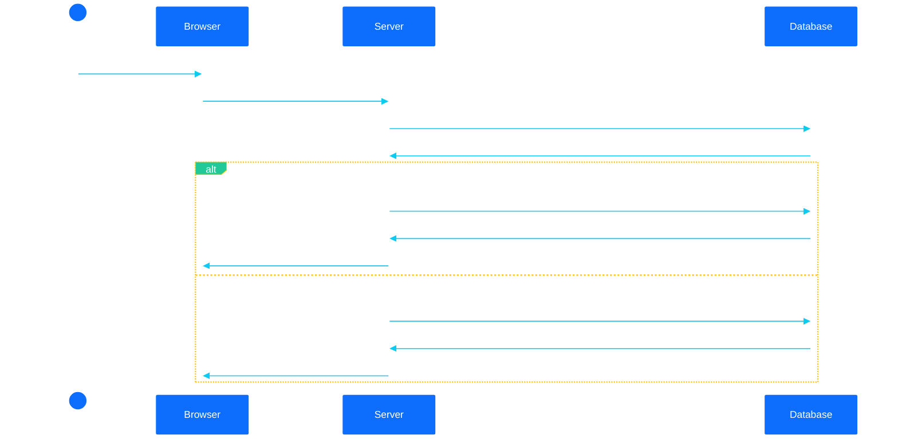
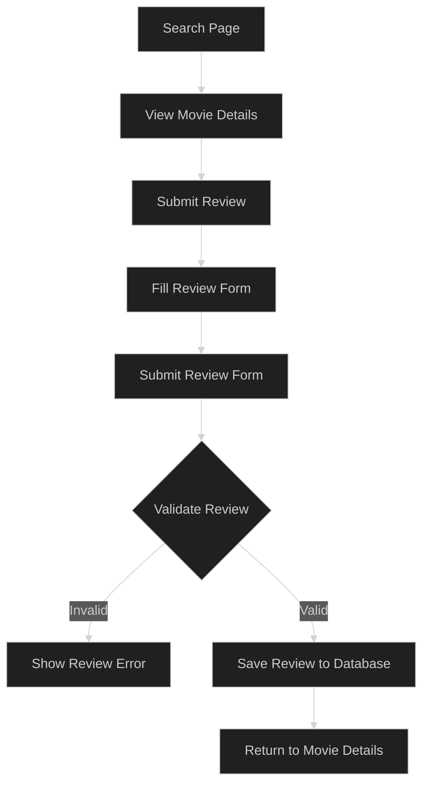
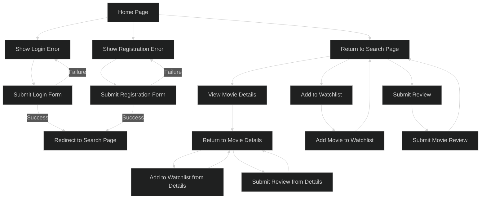

# Post Project
## Rendered by Copilot post Project

cTangonan123: @workspace could you generate mermaid ui diagrams that illustrate the possible actions a user would take?

Workspace: Sure, here are the Mermaid UI diagrams illustrating the possible actions a user would take:

### User Registration Flow

---
#### User Registration Flowchart

---

### User Login Flow

---
#### User Login workflow

### User Search Flow

### User Add to Watchlist Flow

---
#### User Search Flowchart

---
### User Submit Review Flow

---

---
## User navigation flowchart

These diagrams illustrate the main actions a user can take in your application.