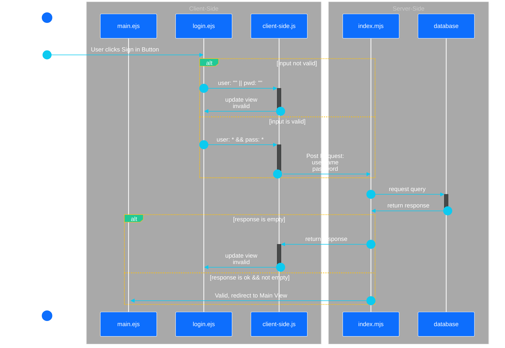
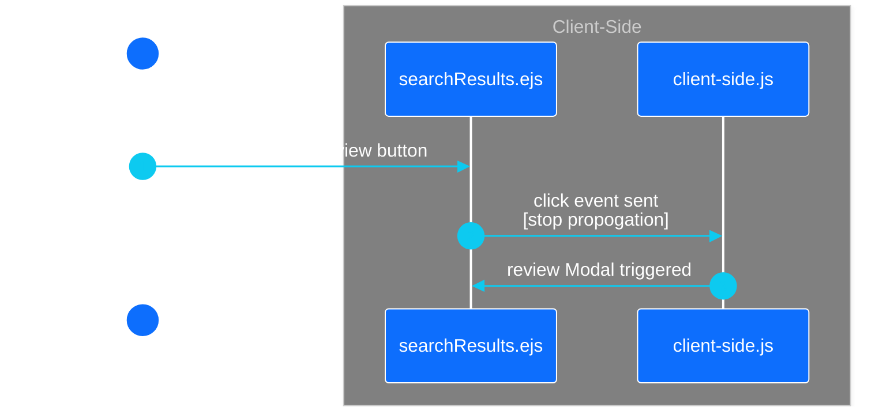
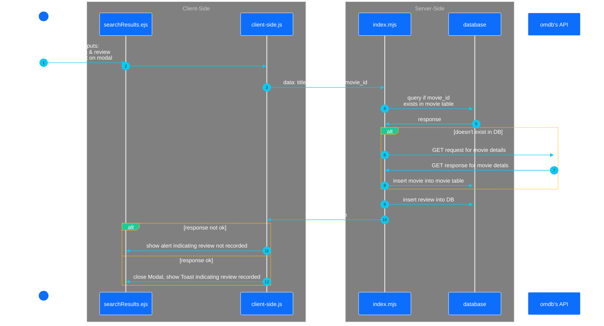
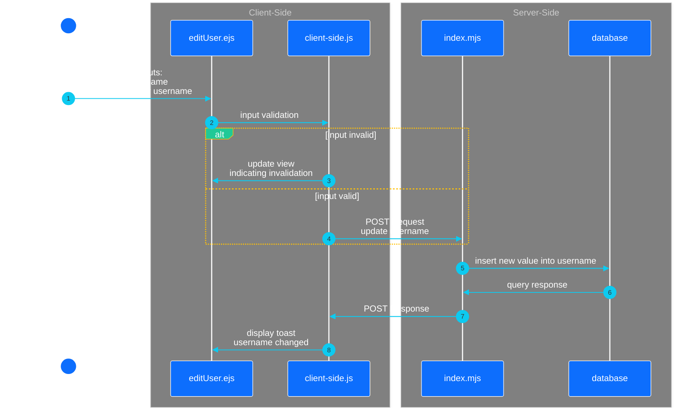
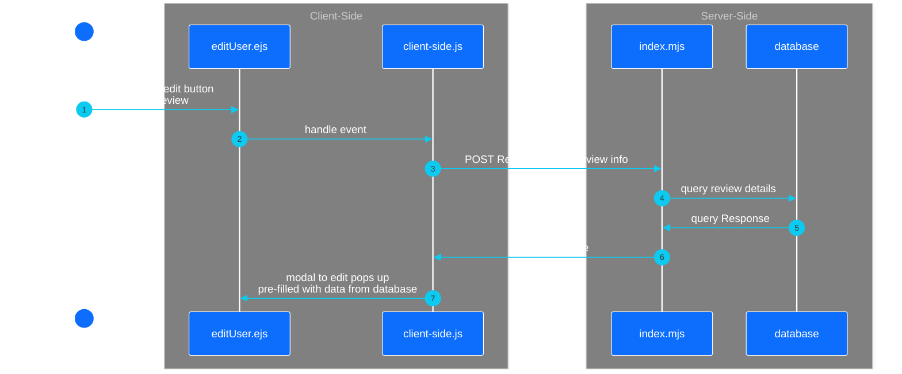
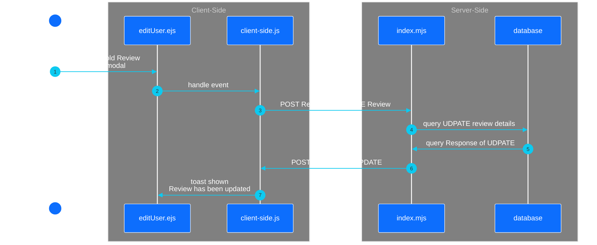

# Sequence Diagrams
## Resources
- [mermaidchart](https://www.mermaidchart.com/landing?utm_source=google_ads&utm_medium=primary_search&utm_campaign=markdownfocus-US&gad_source=1&gclid=Cj0KCQiAgJa6BhCOARIsAMiL7V_qx7LTRMCpA4KrpHJeeZg82YthBNYfP-ypsQgVA6MVsWzpbXP6NNEaAsKAEALw_wcB): mermaid chart application that allows click and drag for different types of diagrams

---
## [Login View](/docs/plan/diagrams/view.md#view-login-page) with sign-in click


---
## [Login View](/docs/plan/diagrams/view.md#view-login-page) User Clicks New User
```mermaid
---
config:
  theme: neo-dark
  themeVariables:
    actorBkg: "#0d6efd"
    actorBorder: white
    actorTextColor: white
    primaryColor: "#0d6efd"
    signalColor: "#0dcaf0"
    sequenceNumberColor: "#0dcaf0"
    signalTextColor: white
    labelBoxBkgColor: "#20c997"
    labelBoxBorderColor: "#ffc107"
    labelTextColor: white
    loopTextColor: white
---
sequenceDiagram
  actor A1 as User
  participant V as login.ejs
  participant CS-JS as client-side.js
  participant SS as index.mjs
  participant DB as database
  autonumber
  A1 ->> V: User clicks Sign Up Button
  V ->>+ CS-JS: 
  CS-JS ->>- V: opens modal for creating User
  alt wait for user input
    V ->> V: 
  end
  V->>+ CS-JS: User Clicks submit button
  CS-JS ->>- SS: send inputs as <br>Post Request
  SS ->>+ DB: send query to DB <br>see if user in db
  DB ->>- SS: respond with query
  alt if response not OK || query returns non-empty
    SS ->>+ CS-JS: send error message
    CS-JS ->>- V: update modal with input vaidation
  else if response OK &&<br> query returns empty
    SS ->> V: render login all over
  end
  box darkgrey Client-Side
    
    participant V
    participant CS-JS
  end
  box darkgrey Server-Side
    participant SS
    participant DB
  end
  ```
---
## [Search View](/docs/plan/diagrams/view.md#view-movie-search) User Inputs and Clicks Search Button
```mermaid
---
config:
  theme: neo-dark
  themeVariables:
    actorBkg: "#0d6efd"
    actorBorder: white
    actorTextColor: white
    primaryColor: "#0d6efd"
    signalColor: "#0dcaf0"
    sequenceNumberColor: "#0dcaf0"
    signalTextColor: white
    labelBoxBkgColor: "#20c997"
    labelBoxBorderColor: "#ffc107"
    labelTextColor: white
    loopTextColor: white
---

sequenceDiagram
  actor U as User
  participant altV as movieDescription.ejs
  participant V as searchContent.ejs
  participant cJS as client-side.js
  participant SS as index.mjs
  participant DB as database
  participant API as omdb's API
  autonumber
  U ->> V: User inputs:<br>search<br>typeOfContent<br>&<br>click's search button
  alt input validation
    V->>cJS: search="" [invalid]
    cJS->>V: update view showing invalidity
  else
    V->>cJS: search="*" [valid]
    cJS->>+SS: POST Request to server for:<br>search & type
  end
  SS->>+API: GET Request of<br>search & type
  
  API->>-SS: GET Response
  alt empty GET response
    SS->>-cJS: POST Repsonse
    cJS->>V: update view showing no response
  else valid GET response
    SS->>altV: redirect to movieDescription.ejs
  end

  box darkgrey Client-Side
    #participant altV
    participant V
    participant cJS
  end
  box darkgrey Server-Side
    participant SS
    participant DB
  end
```
## [Search Results View](/docs/plan/diagrams/view.md#view-search-results)

---
## [Search Results View: Review Modal](/docs/plan/diagrams/view.md#view-movie-review-form)

---
## [View Edit User: username update](/docs/plan/diagrams/view.md#view-edit-user)
- as a note updating of password should be similar, simply replace any instance of username with password instead


---
## [View User Edit: an Edit Review is clicked](/docs/plan/diagrams/view.md#view-edit-user)

---
## [View User Edit: an Edit Review Modal is Filled and Submitted](/docs/plan/diagrams/view.md#view-edit-user)

---


<sub>\< [Back to Docs](/docs/README.md)</sub>
<sub>\<\< [Back to Main Page](/README.md)</sub>

