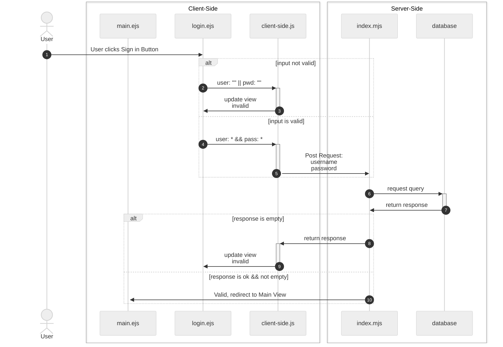

# State Diagrams
## Resources
- [mermaidchart](https://www.mermaidchart.com/landing?utm_source=google_ads&utm_medium=primary_search&utm_campaign=markdownfocus-US&gad_source=1&gclid=Cj0KCQiAgJa6BhCOARIsAMiL7V_qx7LTRMCpA4KrpHJeeZg82YthBNYfP-ypsQgVA6MVsWzpbXP6NNEaAsKAEALw_wcB): mermaid chart application that allows click and drag for different types of diagrams

---
## State: [Login View](/docs/plan/diagrams/view.md#view-login-page) with sign-in click


---
## State: [Login View](/docs/plan/diagrams/view.md#view-login-page) User Clicks New User
```mermaid
---
config:
  theme: neutral
---
sequenceDiagram
  actor A1 as User
  participant V as login.ejs
  participant CS-JS as client-side.js
  participant SS as index.mjs
  participant DB as database
  autonumber
  A1 ->> V: User clicks Sign Up Button
  V ->>+ CS-JS: 
  CS-JS ->>- V: opens modal for creating User
  alt wait for user input
    V ->> V: 
  end
  V->>+ CS-JS: User Clicks submit button
  CS-JS ->>- SS: send inputs as <br>Post Request
  SS ->>+ DB: send query to DB <br>see if user in db
  DB ->>- SS: respond with query
  alt if response not OK || query returns non-empty
    SS ->>+ CS-JS: send error message
    CS-JS ->>- V: update modal with input vaidation
  else if response OK &&<br> query returns empty
    SS ->> V: render login all over
  end
  box transparent Client-Side
    
    participant V
    participant CS-JS
  end
  box transparent Server-Side
    participant SS
    participant DB
  end
  ```
  ---
  ## State: 


<sub>\< [Back to Docs](/docs/README.md)</sub>
<sub>\<\< [Back to Main Page](/README.md)</sub>

